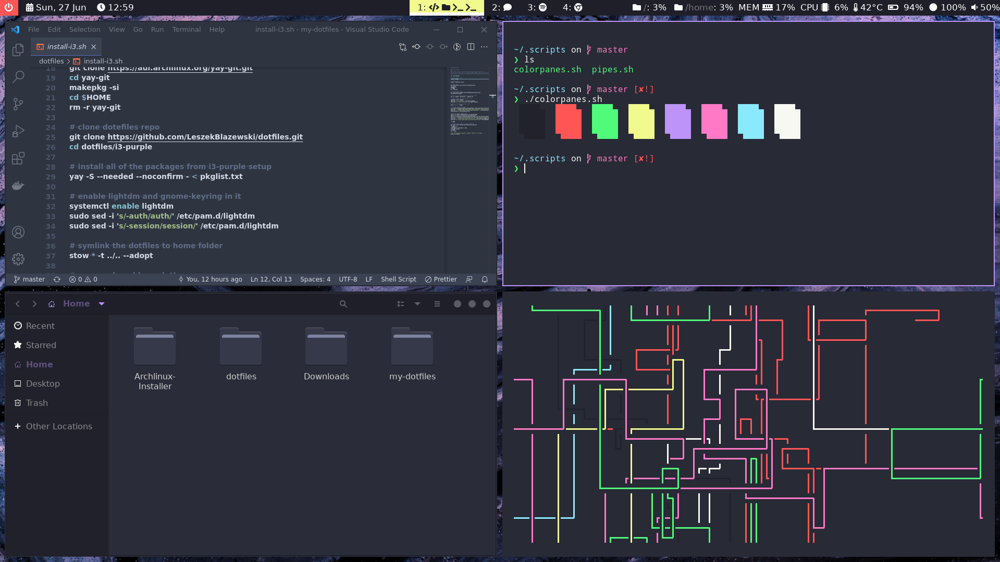

# dotfiles

Dotfiles for various themes mostly gathered from others :D and tweaked to my liking.

## i3-purple

Most of the credits go to https://www.reddit.com/r/unixporn/comments/ntslwf/i3gaps_liquid_amethyst/

**This is the only instalation which is fully automated via dotfiles and is used in install-i3.script**

Components:
- [Dracula GTK theme + icons](https://draculatheme.com/gtk)
- [autonameworkspace for i3](https://github.com/justbuchanan/i3scripts)
- check [all package list](pkglist.txt) for rest



## i3-nord

All credits go to https://www.reddit.com/r/unixporn/comments/f3tnh0/i3gaps_nord/

**This are only dotfiles which can be copied to target system, no automation whatsoever**


Components:

- polybar
- compton-rounded-corners
- vs code nordic theme
- powerline10k
- kitty
- rofi
- [multilockscreen](https://github.com/jeffmhubbard/multilockscreen)

## i3-orange

All credits go to https://github.com/elinahedenius/dots

**This are only dotfiles which can be copied to target system, no automation whatsoever**

Components:

- polybar
- rofi
- kitty
- [zsh bubbly](https://github.com/hohmannr/bubblified)
- [multilockscreen](https://github.com/jeffmhubbard/multilockscreen)

Problems:

- This ZSH theme does not work with visual studio code


## Arch linux automatic installer

<h2 align="center">
  <br>
  
  <br>
Arch Linux Installer
</h2>

<h4 align="center">Install a minimal working Arch Linux more quickly</h4>


All credits go to https://github.com/si9ma/Archlinux-Installer

## Features

- Pseudo interface, more friendly than pure command line. Yeah, you don't have to memorize all the installation wiki commands.
- Support BIOS and UEFI boot mode
- Automatically detect Windows startup option, easily allows dual boot setup
- Purely based on [official arch install guide](https://wiki.archlinux.org/title/installation_guide), nothing more, nothing less, the script follows along all the instructions from wiki.

## Tested and works as of (29/06/2021) for following setups:

- :white_check_mark:**plain UEFI**
- :white_check_mark:**BIOS**
- :white_check_mark:**UEFI + windows** - windows was first installed and then we use his efi partition in the installation (dual boot)

:heavy_exclamation_mark:**NOTE**:heavy_exclamation_mark:

This is simply a bash script, we all love bash, use at your own risk. No guarantees given.

## How To Use

First, you need to prepare an Arch Linux LiveUSB and connect to the internet.

Use this Installer in order to get minimal arch setup

```bash
bash <(curl https://raw.githubusercontent.com/LeszekBlazewski/dotfiles/master/install-arch.sh)
```

Best setup for EN_PL locale (english system with europe locale, polish keyboard and timezone):

- :ok_hand:Set vconsole keyboard layout to pl
- :ok_hand:Set locale as en_DK.UTF-8 UTF-8 (yes this is Denmark, but it has nothing to do with Denmark, best option for EU boys which want a normal english system with EU locales)
- :ok_hand:Set timezone as warsaw

After that your pc will be rebooted and you can use `install-i3.sh` to get a fully working i3 setup (this is for the i3-purple setup).

```bash
sudo bash < <(curl -s https://raw.githubusercontent.com/LeszekBlazewski/dotfiles/master/install-i3.sh)
```
